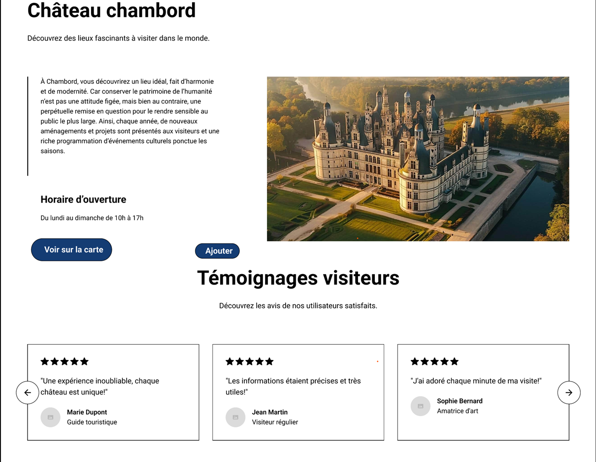

# GestionCommandeVDL
Projet ingénierie logicielle : Balade en Val de Loire
[cf. cahier de charge](Ballade_VDL_SiteWeb_CahierCharge.pdf)
# BALADES DANS LA VALLEE DE LA LOIRE

La Vallée de la Loire est une région exceptionnelle qui réunit patrimoine historique, paysages naturels remarquables et une culture riche. Classée au patrimoine mondial de l'UNESCO, elle abrite plus de 300 châteaux emblématiques, des vins renommés (Sancerre, Chinon, Vouvray) et offre de multiples activités telles que la randonnée, le vélo et le canoë.
Cependant, la promotion des circuits de découverte reste fortement dépendante des supports traditionnels tels que les guides, les cartes et les flyers, souvent considérés comme polluants, coûteux et peu flexibles.
 
 L’objectif de ce projet est de concevoir une solution logicielle innovante pour guider les visiteurs vers la Vallée de la Loire (ou toute autre région) en leur fournissant un guide numérique personnalisé et interactif basé sur les coordonnées GPS. Cela permettra aux utilisateurs de découvrir les lieux, monuments, restaurants, et commerces le long des trajets empruntés.

Applications/outils utilisés :
- Trello
- Visual Paradigm Project
- Looping
- Figma

## 1. Fonctionnalités principales
•	Cartographie interactive : Présentation des points d’intérêt (châteaux, musées, réserves naturelles, etc.) avec descriptions géographiques, historiques et sociales, inspirées du modèle Wikipédia.
•	Recommandations dynamiques : Affichage des lieux valorisés par les utilisateurs grâce à un système de classement.
•	Collaboration ouverte : Intégration des données open data et API libres pour enrichir les informations (textes, images, etc.).
•	Participation des utilisateurs : Possibilité de laisser des commentaires et des photos pour étoffer la présentation des lieux après modération.
•	Support pour les commerçants locaux : Inclusion d’une rubrique dédiée aux commerces, restaurants et bars, accessible via une sollicitation des administrateurs.

## 2. Analyse des besoins

Les processus de fonctionnement identifiés :
- Accès et Inscription (Visiteur, Partenaires, Administrateurs)
- Recherche et Découverte des Lieux (Internaute/Visiteur, Partenaires)
- Interaction et Partage de Contenu (Internaute/Visiteur, Partenaires)
- Mise à Jour et Gestion des Données(Partenaires, Administrateurs)
- Recommandations et Personnalisation (Internaute/Visiteur, Partenaires)
- Modération et Sécurisation (Administrateurs)
- Feedback et Améliorations (Internaute/Visiteur, Administrateurs)

Les acteurs :
- Les Internautes
- Les Partenaires (Commerces, Restaurants, Établissements Locaux)
- Les Administrateurs du Logiciel	

### 2.1 Diagramme de cas d’utilisation

### 2.2 Diagramme MCD

### 2.3 Diagramme MLD

### 2.4 Diagramme de séquence
	### 2.4.1	Créer un itinéraire personnalisé

	### 2.4.2	Soumettre une candidature de partenariat

	#### 2.4.3	Ajouter un commentaire sur un lieu

### 2.5 Diagramme état transition

### 2.6 Diagramme de flux

### 2.7 Diagramme d'activité

## 3. Présentation du site Web

[Lien site](https://www.figma.com/proto/bVaiu6GiXmaA5JcbnaEG9g/Projet-Balade-vall%C3%A9e-de-la-loire?node-id=17-2&p=f&t=q4J1W9UKktlQnsh5-1&scaling=min-zoom&content-scaling=fixed&page-id=5%3A8&starting-point-node-id=17%3A2)

## 4. Conclusion
Notre projet "Balade dans la Vallée de la Loire" propose une solution innovante pour faciliter la découverte des richesses culturelles et historiques de la région. Grâce à des fonctionnalités interactives et des contributions communautaires, l'application offre une expérience enrichissante et personnalisée aux visiteurs.
Ce projet illustre notre capacité à concevoir des solutions numériques adaptées aux besoins des utilisateurs, tout en valorisant le patrimoine local. Nous sommes convaincus qu'il apportera une nouvelle dynamique au tourisme dans la région.
